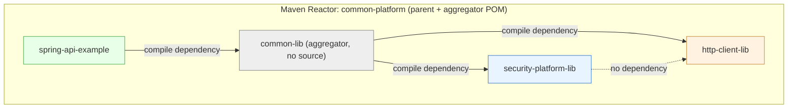
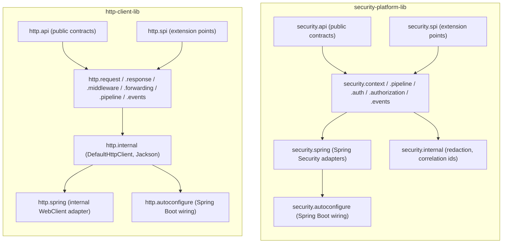
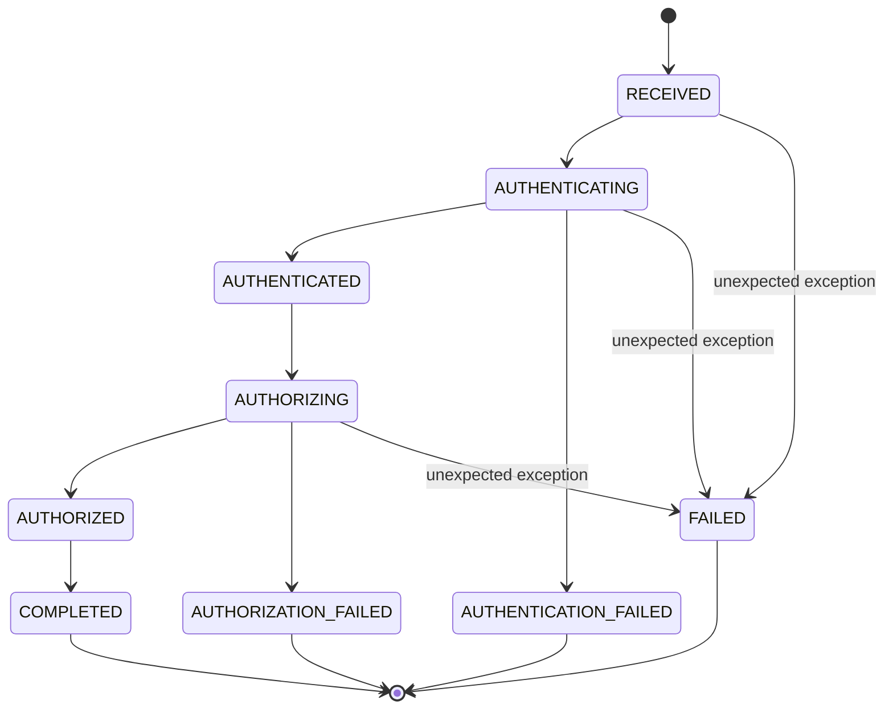
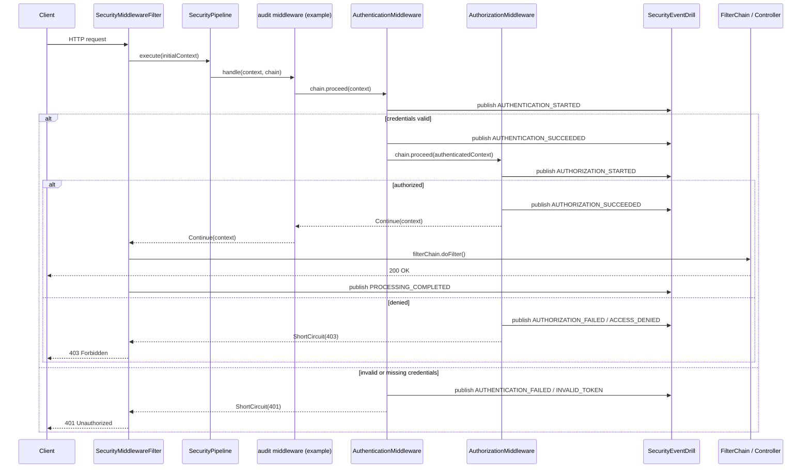
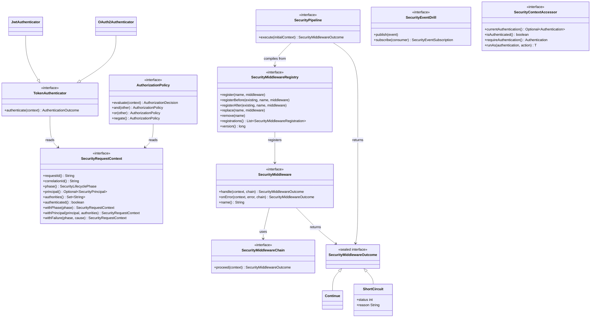
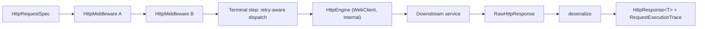
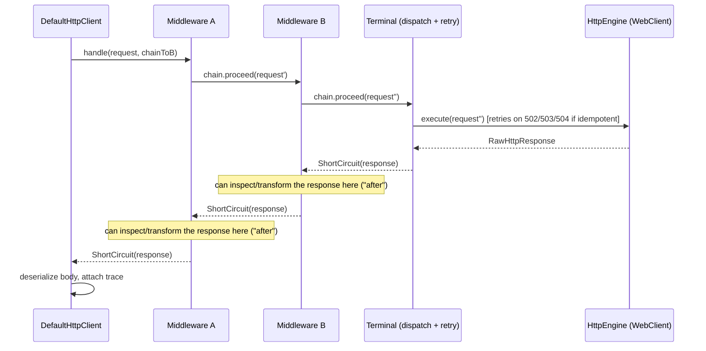
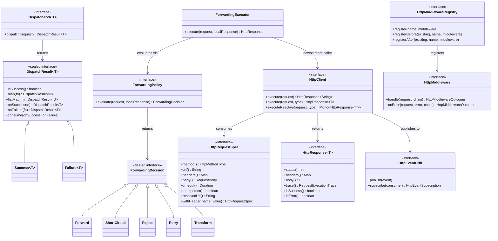
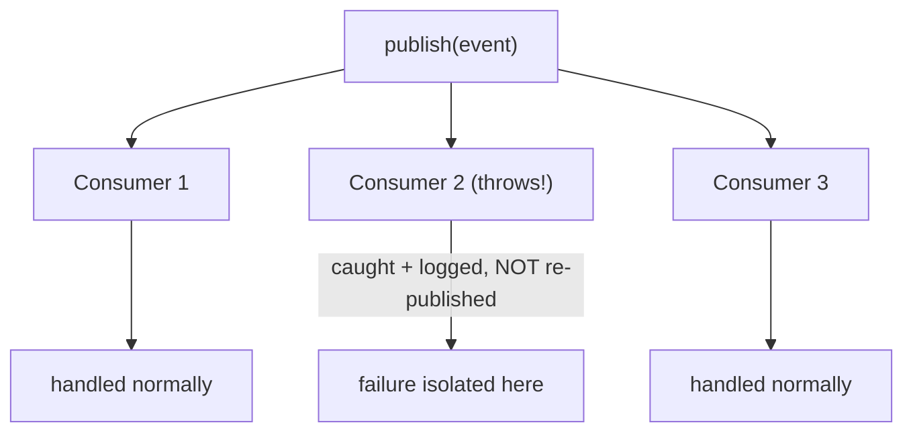
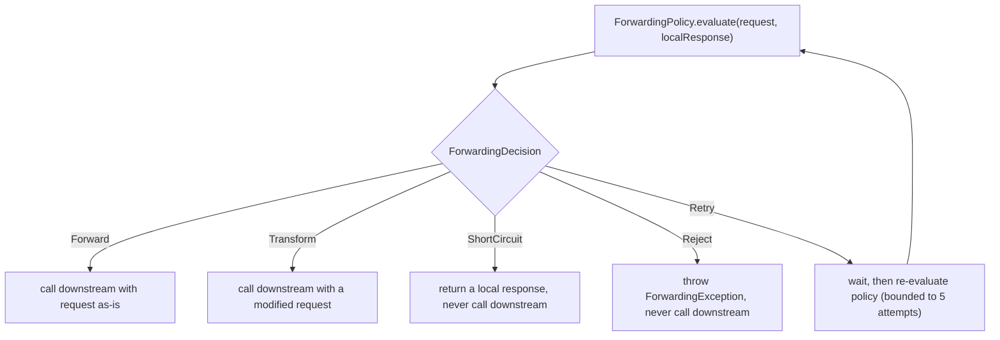

# Common Platform

A Maven multi-module Java platform providing two independently-useful libraries behind one
consumer-facing dependency:

- **`security-platform-lib`** — a platform-level orchestration layer over Spring Security:
  security request context, a middleware pipeline, JWT/OAuth2 authentication, authorization
  policies, and a security event drill.
- **`http-client-lib`** — a declarative HTTP client: immutable request/response model,
  middleware, conditional downstream forwarding, a traceable request pipeline, and an HTTP
  event drill. Built on Spring WebClient, but WebClient never appears in the public API.

Neither library depends on the other. `common-lib` is a thin aggregator so a consuming
application only needs one Maven dependency.

## Table of contents

1. [Architecture](#architecture)
2. [Modules](#modules)
3. [Installing / consuming](#installing--consuming)
4. [Using security-platform-lib](#using-security-platform-lib)
5. [Using http-client-lib](#using-http-client-lib)
6. [Spring Boot configuration reference](#spring-boot-configuration-reference)
7. [Extension points](#extension-points)
8. [Security considerations](#security-considerations)
9. [Threading / blocking / reactive considerations](#threading--blocking--reactive-considerations)
10. [Architecture decisions](#architecture-decisions)
11. [Example application](#example-application)
12. [Real infrastructure: Keycloak, PostgreSQL, and a second service](#real-infrastructure-keycloak-postgresql-and-a-second-service)
13. [Building and testing](#building-and-testing)

## Architecture



```
common-platform (root pom, packaging=pom)
├── security-platform-lib   (independent library)
├── http-client-lib         (independent library)
├── common-lib              (aggregator: depends on both, no source)
└── spring-api-example      (consumer demo, depends on common-lib)
```

The root `pom.xml` is both the **parent POM** (shared Java 21 / plugin configuration,
`dependencyManagement` importing the `spring-boot-dependencies` BOM) and the **aggregator POM**
(`<modules>`). `common-lib` is the **runtime distribution artifact**: it has no source of its
own beyond a `package-info.java`, and depends on both libraries so Maven resolves all three
jars transitively for a consumer that adds a single `<dependency>`.

This is _not_ a shaded/uber jar. A normal Maven dependency does not physically merge JARs —
`common-lib` gives you three jars on the classpath, not one. That's a deliberate choice (see
[Architecture decisions](#architecture-decisions)); the tradeoff is documented, not hidden.

### Package layout

```
security-platform-lib                          http-client-lib
  security.api          public contracts          http.api          public contracts
  security.context       context impl              http.request      request impl
  security.pipeline      middleware engine          http.response     response impl
  security.auth          JWT/OAuth2 authenticators   http.pipeline     tracing (HttpPipeline)
  security.authorization policy composition          http.dispatch    (Dispatcher lives in api)
  security.events        event drill impl            http.middleware  HTTP middleware
  security.spi           user-implementable SPIs      http.forwarding  ForwardingPolicy/Decision
  security.spring        Spring Security adapters     http.events      event drill impl
  security.autoconfigure Spring Boot auto-config       http.spi        RetryPolicy, (de)serializers
  security.internal      redaction, correlation ids   http.spring      WebClient adapter (internal)
                                                       http.autoconfigure Spring Boot auto-config
                                                       http.internal    DefaultHttpClient, Jackson
```

`*.api` is what application code imports. `*.spi` is what extension authors implement.
`*.spring`/`*.internal` are adapter/implementation packages; only `*.spring` classes are
public, and they are documented as the explicit "escape hatch" layer.



### Security request lifecycle



```
RECEIVED → AUTHENTICATING → AUTHENTICATED ─┐
                 │                          ├─→ AUTHORIZING → AUTHORIZED → COMPLETED
                 └─→ AUTHENTICATION_FAILED   └─→ AUTHORIZATION_FAILED
(unexpected errors at any stage → FAILED)
```

`SecurityRequestContext` is an immutable value; every transition (`withPhase`, `withPrincipal`,
`withFailure`, `withAttribute`) returns a new instance. Authentication and authorization are
**not** special-cased steps — they are just the two built-in, well-known
`SecurityMiddleware`s (`SecurityPipelineStages.AUTHENTICATION` / `.AUTHORIZATION`), registered
by auto-configuration. This means `registerBefore`/`registerAfter` against those names is all
you need for "run before/after authentication" — there is no separate low-level filter-order API.

How a request actually moves through the pipeline (built-in `audit` middleware, then the
built-in authentication/authorization middleware, then the servlet filter chain):



Core security contracts (UML class diagram):



### HTTP request pipeline



```
Request → [Middleware A] → [Middleware B] → Dispatcher (retry-aware) → Downstream → Response
```

Every `HttpMiddleware` gets full "around" semantics from one method:
`handle(request, chain)` calls `chain.proceed(request)` and receives back the _actual response_
(the middleware chain's terminal step performs the real dispatch), so a middleware can inspect
headers on the way in **and** the response on the way out without four separate hook types.
The call/return (not just forward) shape of that chain:



Core HTTP contracts (UML class diagram):



## Modules

| Module            | Artifact                | Purpose                                                    |
| ----------------- | ----------------------- | ---------------------------------------------------------- |
| Parent/aggregator | `common-platform`       | Build configuration, module list, dependency management    |
| Security library  | `security-platform-lib` | Security context, middleware, auth, authorization, events  |
| HTTP library      | `http-client-lib`       | Request/response, dispatch, forwarding, middleware, events |
| Distribution      | `common-lib`            | Single dependency for consumers                            |
| Example           | `spring-api-example`    | Runnable Spring Boot API demonstrating both libraries      |

## Installing / consuming

```xml
<dependency>
    <groupId>com.platform</groupId>
    <artifactId>common-lib</artifactId>
    <version>1.0.0-SNAPSHOT</version>
</dependency>
```

Adding this one dependency to a Spring Boot application makes both `security-platform-lib` and
`http-client-lib` beans available automatically — both modules ship a
`META-INF/spring/org.springframework.boot.autoconfigure.AutoConfiguration.imports` file, and
Spring Boot's `ImportCandidates` mechanism reads _all_ such files found on the classpath (it
uses `ClassLoader.getResources`, which returns one entry per jar), so no glue code in
`common-lib` is required for both to activate.

If you only need one of the two capabilities, depend on `security-platform-lib` or
`http-client-lib` directly instead of `common-lib`.

## Using security-platform-lib

### Registering middleware

```java
@Bean
public ApplicationRunner registerAuditMiddleware(SecurityMiddlewareRegistry registry) {
    return args -> registry.registerBefore(SecurityPipelineStages.AUTHENTICATION, "audit",
            SecurityMiddleware.named("audit")
                    .before(ctx -> { log.info("{} {}", ctx.requestMethod(), ctx.requestPath()); return ctx; })
                    .after(ctx -> { log.info("completed phase={}", ctx.phase()); return ctx; })
                    .build());
}
```

`SecurityMiddlewareRegistry` supports `register`, `registerBefore`, `registerAfter`, `replace`,
`remove`, `enable`/`disable`, and per-request `condition(...)` predicates. It is the
_configuration_ surface; `SecurityPipeline` is the _compiled, executable_ chain built from it
(recompiled lazily whenever the registry's `version()` changes).

### Wiring into Spring Security

```java
@Bean
public SecurityFilterChain apiFilterChain(HttpSecurity http, SecurityPipeline pipeline,
        SecurityEventDrill eventDrill, SecurityFailureHandler failureHandler) throws Exception {
    http.securityMatcher("/api/**")
        .csrf(csrf -> csrf.disable())
        .with(SecurityPlatformConfigurer.securityPlatform(pipeline, eventDrill, failureHandler),
                Customizer.withDefaults())
        .authorizeHttpRequests(auth -> auth.anyRequest().permitAll());
    return http.build();
}
```

The platform never registers its own `SecurityFilterChain` — you always wire it into your own,
so it can never silently override your application's security configuration.

### JWT authentication

```yaml
security-platform:
  jwt:
    enabled: true
    jwk-set-uri: https://idp.example.com/.well-known/jwks.json # or hmac-secret for demos
    authority-claim: roles
    authority-prefix: "ROLE_"
```

Signature verification and standard claim validation (`exp`, `nbf`, `iss`) are delegated
entirely to Spring Security's own `JwtDecoder` (backed by Nimbus JOSE+JWT) — the library never
implements JWT cryptography itself.

### Authorization

```java
@Bean
public AuthorizationPolicy authorizationPolicy() {
    return AuthorizationPolicies.requireAuthority("ROLE_ADMIN")
            .or(AuthorizationPolicies.allowIf(ctx -> ctx.requestMethod().equals("GET"), "read-only fallback"));
}
```

### Security context access

```java
public UserResponse getUser(@PathVariable String id, SecurityContextAccessor accessor) {
    String requestedBy = accessor.currentPrincipal().map(SecurityPrincipal::name).orElse("anonymous");
    ...
}
```

`SecurityContextAccessor` is backed by Spring Security's own `SecurityContextHolder` (not a
second, parallel `ThreadLocal`). `runAs(authentication, action)` is the only sanctioned way to
temporarily execute code under a different authentication; it always restores the previous
context, even on failure.

### Events (the "security event drill")

```java
@Component
public class SiemForwarder implements SecurityEventConsumer {
    public SiemForwarder(SecurityEventDrill drill) { drill.subscribe(this); }
    public void onEvent(SecurityEvent event) { /* ship to SIEM, using event.type()/correlationId()/... */ }
}
```

A throwing consumer is caught, logged, and skipped — it never breaks the pipeline and is never
re-published as a new event (which would risk recursion). Both event drills (security and HTTP)
follow the same isolation pattern:



## Using http-client-lib

### Declarative requests

```java
HttpResponse<Order> response = httpClient.execute(
        HttpRequestSpec.post("/orders")
                .header("X-Tenant", tenantId)
                .body(orderRequest)
                .timeout(Duration.ofSeconds(5))
                .build(),
        Order.class);
```

### Declarative dispatch / consumption

```java
DispatchResult<OrderResponse> result = someDispatcher.dispatch(request)
        .map(this::toOrderResponse)
        .onSuccess(order -> log.info("order {} created", order.orderId()))
        .onFailure(error -> log.warn("order failed", error));
```

`DispatchResult<T>` (`Success`/`Failure`) is a small, dedicated sealed type — not `Mono` —
because `Mono` requires subscription semantics that are easy to misuse for a simple
"dispatch and consume" flow. `Mono` remains available for advanced users via
`HttpClient.executeReactive(...)`.

### Conditional forwarding

```java
ForwardingPolicy policy = (request, localResponse) -> request.uri().contains("/BLOCKED")
        ? ForwardingDecision.reject("blocked by policy")
        : ForwardingDecision.forward(request);

ForwardingExecutor executor = new ForwardingExecutor(policy, req -> httpClient.execute(req, Inventory.class));
```

`ForwardingDecision` is a sealed type (`Forward`, `ShortCircuit`, `Reject`, `Retry`,
`Transform`) rather than a boolean `shouldForward()`, so the _reason_ for a decision is
observable. `Retry` is bounded (max 5 attempts) so a misconfigured policy can never loop
forever.



### Pipeline tracing

```java
HttpResponse<Order> response = httpClient.execute(request, Order.class);
RequestExecutionTrace trace = response.trace();
trace.stages().forEach(stage -> log.info("{}: {}ms ({})", stage.name(), stage.duration().toMillis(), stage.success()));
```

### Middleware

```java
httpMiddlewareRegistry.register("correlation-id", (request, chain) ->
        chain.proceed(request.withHeader("X-Correlation-Id", request.correlationId())));
```

### Retries

Retries are explicit and **idempotent-only by default** — a `POST` is never silently retried
and duplicated unless the request is explicitly marked `.idempotent(true)` or
`http-client.retry.idempotent-only: false` is set application-wide.

### Events

Same shape as the security event drill (`HttpEventDrill`/`HttpEvent`/`HttpEventConsumer`),
independently implemented — see [Architecture decisions](#architecture-decisions) for why the
two event drills are not unified into one generic type.

## Spring Boot configuration reference

```yaml
security-platform:
  enabled: true
  authentication-required: true
  jwt:
    enabled: false
    jwk-set-uri:
    hmac-secret: # demo/HMAC only - use jwk-set-uri + RS256/ES256 in production
    issuer:
    audience:
    authority-claim: roles
    authority-prefix: "ROLE_"
  oauth2:
    enabled: false # adapts an Authentication already produced by Spring's own resource server
  events:
    logging-consumer-enabled: true

http-client:
  enabled: true
  default-timeout: 10s
  connect-timeout: 5s
  retry:
    max-attempts: 3
    initial-backoff: 200ms
    backoff-multiplier: 2.0
    max-backoff: 5s
    retryable-status-codes: [502, 503, 504]
    idempotent-only: true
  events:
    logging-consumer-enabled: true
```

All beans are `@ConditionalOnMissingBean`, so supplying your own `SecurityEventDrill`,
`AuthorizationPolicy`, `HttpClient`, etc. simply overrides the default — nothing is forced on
you, and nothing is created unexpectedly on top of application-provided beans.

## Extension points

Implement and register/expose as a bean:

- `TokenAuthenticator` / `JwtAuthenticator` / `OAuth2Authenticator` — custom authentication mechanisms.
- `AuthorizationPolicy` — custom authorization rules (composable via `and`/`or`/negate`).
- `SecurityMiddleware` / `HttpMiddleware` — custom pipeline steps.
- `SecurityEventConsumer` / `HttpEventConsumer` — custom event sinks (logging/metrics/audit/SIEM).
- `SecurityContextEnricher`, `SecurityFailureHandler`, `SecurityRequestInspector` (`security.spi`).
- `ForwardingPolicy` — custom forwarding rules.
- `BodySerializer` / `BodyDeserializer` (`http.spi`) — custom (de)serialization.

Escape hatches for advanced/low-level access:

- `com.platform.security.spring.ServletRequestAccess` — raw `HttpServletRequest`/`Response`.
- `SecurityContextAccessor#currentAuthentication()` — the underlying Spring Security `Authentication`.
- `com.platform.security.auth.AuthenticationProviderAdapter` — use the platform's JWT validation
  inside a plain Spring Security `AuthenticationProvider`, without adopting the pipeline.
- `HttpClient#executeReactive(...)` — a `Mono<HttpResponse<T>>` for reactive composition.

## Security considerations

- Neither library logs passwords, tokens, `Authorization`/`Cookie` headers, or secrets by
  default. `Redaction` utilities (one per library, `*.internal.Redaction`) mask sensitive
  header names and metadata keys (`token`, `secret`, `credential`, `authorization`, `apikey`,
  `privatekey`, ...) before anything reaches a built-in logging consumer.
- `JwtAuthenticationToken#toString()` relies on Spring's own `AbstractAuthenticationToken`
  credential redaction (`Credentials=[PROTECTED]`).
- The default failure response body contains only a status, a reason string, and a correlation
  ID — never a stack trace or internal exception details.
- The example application's `DevTokenController` mints JWTs signed with a hardcoded HMAC
  secret purely so the demo is runnable without an external identity provider. It is
  deliberately excluded from the security filter chain and is **not** a pattern to copy into a
  real application — use a real IdP / OAuth2 authorization server, and asymmetric keys
  (`jwk-set-uri`) in production.

## Threading / blocking / reactive considerations

- **Security library is servlet-focused.** It integrates with the classic Spring Security
  filter chain and `SecurityContextHolder`. Reactive (WebFlux) support is explicitly out of
  scope; do not use `SecurityMiddlewareFilter` in a WebFlux application.
- `SecurityContextAccessor` reads/writes through `SecurityContextHolder`, so its behavior
  across thread pools/`@Async` matches whatever Spring Security strategy the application
  already configures (`MODE_THREADLOCAL` by default).
- **HTTP client is a sync facade over WebClient.** `HttpClient.execute(...)` blocks the calling
  thread on an internal `.block(timeout)` call inside `WebClientHttpEngine` — the one and only
  blocking call site in the library. This is safe from a Spring MVC controller/service thread.
  `executeReactive(...)` offloads that same blocking call onto `Schedulers.boundedElastic()` so
  it does not tie up a non-blocking (e.g. Netty event-loop) thread — it is a bridge, not a
  fully non-blocking call path end-to-end; this tradeoff is intentional given the sync-facade
  design decision, not an oversight.
- No hidden thread pools are created by either library. The only executor involved is the one
  WebClient/Reactor Netty already manages internally, plus the `boundedElastic` scheduler used
  only by the reactive escape hatch.

## Architecture decisions

- **`common-lib` is an aggregator dependency, not a shaded uber-jar.** A Maven parent POM is
  not itself a runtime library, and a normal dependency does not physically merge JARs. Shading
  Spring Boot libraries risks class relocation issues and duplicate Spring classes; we judged
  that risk not worth it just to produce "one physical jar" when "one Maven dependency,
  transitively resolving three jars" already satisfies the actual requirement.
- **No shared `CommonPipeline<T>`/event abstraction between the two libraries.** Security and
  HTTP middleware/events look similar but have different semantics (a security middleware
  reasons about authentication/authorization state; an HTTP middleware reasons about
  requests/responses). Sharing one generic abstraction would have made both APIs vaguer. Each
  library also defines its own self-contained exception hierarchy
  (`SecurityPlatformException`/`HttpClientPlatformException`) rather than a shared root, to
  avoid introducing either a compile-time dependency between the libraries or a third module
  solely for one abstract class.
- **Authentication/authorization are middleware, not special-cased pipeline stages.** This
  keeps the security pipeline model to one concept (`SecurityMiddleware`) instead of two.
- **HTTP middleware's terminal step performs the actual dispatch** (with retry), returning it
  as a `ShortCircuit` outcome, so middleware gets genuine "around" semantics (request AND
  response inspection) from a single `handle(request, chain)` method.
- **JWT verification delegates to Spring Security's `JwtDecoder`** (backed by Nimbus
  JOSE+JWT) rather than hand-rolling signature verification.
- **OAuth2 support is a thin adapter** over Spring Security's own resource-server filter/
  `Authentication`, not a reimplementation of OAuth2.

## Example application

`spring-api-example` is a runnable Spring Boot app (port `8081`) demonstrating:

| Endpoint                                   | Demonstrates                                                                                                                     |
| ------------------------------------------ | -------------------------------------------------------------------------------------------------------------------------------- |
| `GET /api/users/{id}`                      | JWT auth, `ROLE_USER` authorization, `SecurityContextAccessor`                                                                   |
| `POST /api/orders`                         | `ROLE_ADMIN` authorization, declarative HTTP client call to a downstream service, `DispatchResult` consumption, pipeline tracing |
| `GET /api/gateway/inventory/{sku}`         | Conditional forwarding (`ForwardingPolicy`/`ForwardingExecutor`)                                                                 |
| `GET /internal/inventory/{sku}`            | Simulated downstream service (outside the security filter chain)                                                                 |
| `GET /dev/token?subject=alice&roles=ADMIN` | DEV-ONLY: mints a demo JWT                                                                                                       |

End-to-end flow for `POST /api/orders`, tying both libraries together:

```mermaid
sequenceDiagram
    participant C as Client
    participant F as SecurityMiddlewareFilter
    participant Sec as Security pipeline (audit, authn, authz)
    participant Ctrl as OrderController
    participant Svc as OrderService
    participant Http as HttpClient
    participant Inv as InventoryController (simulated downstream)

    C->>F: POST /api/orders (Bearer token)
    F->>Sec: execute(context)
    Sec-->>F: Continue (ROLE_ADMIN authorized)
    F->>Ctrl: filterChain.doFilter()
    Ctrl->>Svc: placeOrder(request)
    Svc->>Http: execute(GET /internal/inventory/{sku})
    Http->>Inv: HTTP GET
    Inv-->>Http: 200 {sku, quantity}
    Http-->>Svc: HttpResponse&lt;InventoryResponse&gt; + trace
    alt sufficient inventory
        Svc-->>Ctrl: DispatchResult.Success(OrderResponse)
        Ctrl-->>C: 201 Created
    else insufficient inventory
        Svc-->>Ctrl: DispatchResult.Failure(error)
        Ctrl-->>C: 409 Conflict
    end
```

Run it:

```bash
mvn -pl spring-api-example -am spring-boot:run
```

Then, in another terminal:

```bash
TOKEN=$(curl -s "http://localhost:8081/dev/token?subject=alice&roles=ADMIN" | python3 -c "import sys,json;print(json.load(sys.stdin)['token'])")

curl -i http://localhost:8081/api/users/1                                   # 401, no token
curl -i -H "Authorization: Bearer $TOKEN" http://localhost:8081/api/users/1  # 200
curl -i -H "Authorization: Bearer $TOKEN" -H "Content-Type: application/json" \
     -d '{"sku":"WIDGET","quantity":1}' http://localhost:8081/api/orders    # 201
curl -i -H "Authorization: Bearer $TOKEN" http://localhost:8081/api/gateway/inventory/BLOCKED-1  # 403
```

Watch the console log for `[audit]`, `[SECURITY-AUDIT]`, `[HTTP-AUDIT]` and pipeline-trace
lines showing the request's journey through the platform.

## Real infrastructure: Keycloak, PostgreSQL, and a second service

The example above uses a demo HMAC JWT and an in-process downstream controller so it runs with
zero setup. For a full environment with a **real** Keycloak (OAuth2/OIDC provider), PostgreSQL,
and a genuinely separate `downstream-api` service - proving the libraries against real
infrastructure rather than fakes - see [`infra/README.md`](infra/README.md) and
[`infra/ARCHITECTURE.md`](infra/ARCHITECTURE.md):

```bash
cp infra/.env.example infra/.env
./infra/scripts/up.sh
./infra/scripts/health.sh
./infra/scripts/smoke-test.sh
```

This starts `spring-api-example` in its `docker` Spring profile (real JWT validation against
Keycloak's JWKS, service-to-service calls to `downstream-api` via OAuth2 `client_credentials`)
alongside the same `downstream-api` module described above. A Testcontainers-based integration
test (`KeycloakIntegrationTest`, run via `mvn test -Pdocker-tests`) exercises the same realm
configuration for CI.

## Building and testing

```bash
mvn clean verify
```

Compiles all modules and runs the full test suite (unit tests for both libraries, including a
JWT round-trip against real Nimbus-signed tokens, MockWebServer-backed HTTP integration tests,
Spring `ApplicationContextRunner` auto-configuration tests, and an end-to-end Spring Boot test
for the example application). `KeycloakIntegrationTest` (Testcontainers, needs Docker) is
excluded from this by default - see [`infra/README.md`](infra/README.md#testcontainers-ci).
