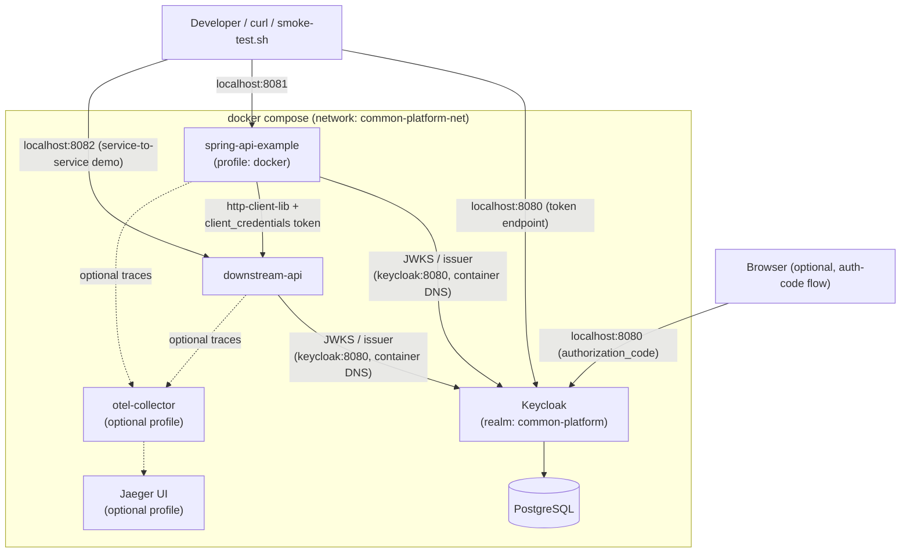

# Local Infrastructure: Keycloak + PostgreSQL + downstream-api

A reproducible local environment so `security-platform-lib` and `http-client-lib` can be
exercised against **real** OAuth2/OIDC infrastructure - not fakes. No manual Keycloak UI
configuration is required; the realm, clients, roles, users and protocol mappers are all
imported automatically at container startup.

## Architecture



`security-platform-lib` and `http-client-lib` are the same libraries from the root of this
repository - `spring-api-example` and `downstream-api` both depend on `common-lib` exactly like
any other consumer would. **Keycloak is the identity provider; the libraries are the
integration/orchestration layer on top of Spring Security and WebClient - they do not replace
either.**

## Prerequisites

- Docker + Docker Compose v2 (`docker compose version`).
- `curl` and `jq` (used by `scripts/smoke-test.sh`).
- Ports `8080` (Keycloak), `8081` (spring-api-example), `8082` (downstream-api), `5432`
  (Postgres) free on the host. `16686` (Jaeger UI) if using the observability profile.
- ~4 GB RAM free for the containers.
- To run `spring-api-example`/`downstream-api` **outside** Docker (`./mvnw spring-boot:run`)
  against this same Keycloak, add one line to your hosts file (see "Networking & issuer
  consistency" below): `127.0.0.1 keycloak`.

## Quick start

```bash
cp infra/.env.example infra/.env
./infra/scripts/up.sh            # or: ./infra/scripts/up.sh --observability
./infra/scripts/health.sh        # waits for every service to report healthy
./infra/scripts/smoke-test.sh    # exercises the full stack end-to-end
```

Shut down (keeps data): `./infra/scripts/down.sh`
Full reset (drops the Postgres volume, re-imports the realm from scratch): `./infra/scripts/reset.sh`

## Networking & issuer consistency

This is the single trickiest part of any Docker + OIDC setup, so it's called out explicitly.

Keycloak is started with a **fixed hostname** (`KC_HOSTNAME=keycloak`), so its issuer and JWKS
URLs are _always_ `http://keycloak:8080/realms/common-platform...`, **regardless of which
network path was used to reach it**:

- From the host (browser, curl, `smoke-test.sh`): reachable at `http://localhost:8080` (the
  published port), but the token's `iss` claim will still read `http://keycloak:8080/...`
  because `KC_HOSTNAME` is fixed, not derived from the request's `Host` header.
- From inside the Docker network (`spring-api-example`, `downstream-api` containers): reachable
  at `http://keycloak:8080` directly via Docker's embedded DNS - the _same_ value as the issuer,
  so JWKS discovery and issuer validation "just work" with zero `host.docker.internal` tricks.

If you run `spring-api-example` or `downstream-api` **on the bare host** (`./mvnw
spring-boot:run`) instead of in Docker, they still need to resolve `keycloak` to reach the same
issuer - add `127.0.0.1 keycloak` to `/etc/hosts` (or Windows'
`C:\Windows\System32\drivers\etc\hosts`) once. This is a one-time environment setup step, not a
URL rewrite - the exact same `issuer`/`jwk-set-uri` values work in both cases.

## Keycloak

|                        |                                                                                                  |
| ---------------------- | ------------------------------------------------------------------------------------------------ |
| Admin console          | http://localhost:8080/admin (container-to-container: not applicable, admin console is host-only) |
| Admin user             | `admin` / `admin-dev-only-password` (from `.env`) - **local development only**                   |
| Realm                  | `common-platform`                                                                                |
| Issuer                 | `http://keycloak:8080/realms/common-platform`                                                    |
| Authorization endpoint | `http://localhost:8080/realms/common-platform/protocol/openid-connect/auth`                      |
| Token endpoint         | `http://localhost:8080/realms/common-platform/protocol/openid-connect/token`                     |
| JWKS endpoint          | `http://localhost:8080/realms/common-platform/protocol/openid-connect/certs`                     |
| Userinfo endpoint      | `http://localhost:8080/realms/common-platform/protocol/openid-connect/userinfo`                  |
| Logout endpoint        | `http://localhost:8080/realms/common-platform/protocol/openid-connect/logout`                    |
| OIDC discovery         | `http://localhost:8080/realms/common-platform/.well-known/openid-configuration`                  |

Realm/clients/roles/users are defined in
[`keycloak/realm/common-platform-realm.json`](keycloak/realm/common-platform-realm.json) and
imported automatically via `start-dev --import-realm` - no manual UI steps.

### Clients

| Client ID            | Type         | Flow                                                                    | Purpose                                                                                  |
| -------------------- | ------------ | ----------------------------------------------------------------------- | ---------------------------------------------------------------------------------------- |
| `interactive-client` | Public       | `authorization_code` + PKCE (also `direct-access-grants` for scripting) | Browser login demo; smoke-test uses its password grant against test users                |
| `service-client`     | Confidential | `client_credentials`                                                    | Service-to-service: `spring-api-example` calls `downstream-api` with this client's token |

There is intentionally **no** Keycloak client for the resource servers themselves
(`spring-api-example`/`downstream-api`) - pure bearer-token validation only needs an
issuer/JWKS, not a registered client.

### Roles & test users

| User                                                 | Password                 | Roles                                |
| ---------------------------------------------------- | ------------------------ | ------------------------------------ |
| `alice`                                              | `password`               | `USER`                               |
| `bob`                                                | `password`               | `USER`, `DOWNSTREAM_ACCESS`          |
| `admin`                                              | `password`               | `USER`, `ADMIN`, `DOWNSTREAM_ACCESS` |
| _(service account)_ `service-account-service-client` | n/a (client_credentials) | `DOWNSTREAM_ACCESS`                  |

**These are obviously-fake local-development passwords, documented here on purpose. Never reuse
them anywhere real.** Roles are delivered as a flat, top-level `roles` claim in the JWT (via a
custom protocol mapper - Keycloak's default `realm_access.roles` claim is nested and doesn't
match `JwtAuthorityMappers.fromClaim("roles", "ROLE_")` in `security-platform-lib`) and mapped to
Spring authorities `ROLE_USER`, `ROLE_ADMIN`, `ROLE_DOWNSTREAM_ACCESS`. Nothing in the
application is hardcoded to a username - authorization is entirely claim/authority-driven (see
`DemoAuthorizationPolicyConfig` in `spring-api-example` and `DownstreamAuthorizationPolicyConfig`
in `downstream-api`).

## Token acquisition

### Scriptable (ROPC / password grant, test users only - what `smoke-test.sh` uses)

```bash
TOKEN=$(curl -s -X POST http://localhost:8080/realms/common-platform/protocol/openid-connect/token \
  -H "Content-Type: application/x-www-form-urlencoded" \
  -d grant_type=password \
  -d client_id=interactive-client \
  -d username=alice \
  -d password=password | jq -r .access_token)
```

### Browser (real authorization_code + PKCE flow)

1. Open (in a browser):
   `http://localhost:8080/realms/common-platform/protocol/openid-connect/auth?client_id=interactive-client&response_type=code&scope=openid&redirect_uri=http://localhost:18080/callback&code_challenge=<S256 challenge>&code_challenge_method=S256`
   (any local PKCE-capable OAuth2 test client/tool, or a throwaway static page at
   `redirect_uri`, can complete this - a full interactive walkthrough necessarily needs a
   browser, unlike the ROPC grant above).
2. Log in as `alice`/`password`.
3. Keycloak redirects to `redirect_uri` with `?code=...`.
4. Exchange the code at the token endpoint (`grant_type=authorization_code`) with the same
   `code_verifier` used to derive the challenge.

### Service-to-service (client_credentials)

```bash
curl -s -X POST http://localhost:8080/realms/common-platform/protocol/openid-connect/token \
  -H "Content-Type: application/x-www-form-urlencoded" \
  -d grant_type=client_credentials \
  -d client_id=service-client \
  -d client_secret=service-client-secret-dev-only | jq -r .access_token
```

`spring-api-example` obtains this token itself (via `ClientCredentialsAuthMiddleware`, backed by
Spring Security's `OAuth2AuthorizedClientManager`) whenever it calls `downstream-api` - you don't
need to do this manually except to test `downstream-api` directly.

## API examples

```bash
# Public: rejected (401), no Authorization header
curl -i http://localhost:8081/api/users/1

# Protected: succeeds as alice (USER)
curl -i -H "Authorization: Bearer $TOKEN" http://localhost:8081/api/users/1

# Admin-only endpoint: succeeds as admin, fails (403) as alice
ADMIN_TOKEN=$(curl -s -X POST http://localhost:8080/realms/common-platform/protocol/openid-connect/token \
  -d grant_type=password -d client_id=interactive-client -d username=admin -d password=password \
  | jq -r .access_token)
curl -i -H "Authorization: Bearer $ADMIN_TOKEN" -H "Content-Type: application/json" \
     -d '{"sku":"WIDGET","quantity":1}' http://localhost:8081/api/orders

# Trigger an authorization failure (alice lacks ROLE_ADMIN)
curl -i -H "Authorization: Bearer $TOKEN" -H "Content-Type: application/json" \
     -d '{"sku":"WIDGET","quantity":1}' http://localhost:8081/api/orders

# Trigger a downstream request + conditional forwarding
curl -i -H "Authorization: Bearer $TOKEN" http://localhost:8081/api/gateway/inventory/WIDGET     # forwarded, 200
curl -i -H "Authorization: Bearer $TOKEN" http://localhost:8081/api/gateway/inventory/BLOCKED-1  # short-circuited, 403

# Correlation ID propagation - same ID shows up in both services' logs
curl -i -H "Authorization: Bearer $ADMIN_TOKEN" -H "Content-Type: application/json" \
     -H "X-Correlation-Id: demo-trace-1" \
     -d '{"sku":"WIDGET","quantity":1}' http://localhost:8081/api/orders
docker compose -f infra/docker-compose.yml logs spring-api-example downstream-api | grep demo-trace-1
```

## Failure scenarios

| Scenario                          | How to trigger                                                                                             |
| --------------------------------- | ---------------------------------------------------------------------------------------------------------- |
| No `Authorization` header         | omit `-H "Authorization: ..."` -> `401`                                                                    |
| Malformed token                   | `-H "Authorization: Bearer not-a-jwt"` -> `401`                                                            |
| Expired token                     | wait past `accessTokenLifespan` (300s in the realm config), or request a token then wait                   |
| Invalid issuer                    | craft a token with a different issuer (e.g. from a scratch Keycloak realm) -> `401`                        |
| Insufficient authority            | call `/api/orders` (needs `ROLE_ADMIN`) as `alice` -> `403`                                                |
| Downstream authentication failure | `curl -H "Authorization: Bearer garbage" http://localhost:8082/internal/inventory/WIDGET` -> `401`         |
| Downstream authorization failure  | obtain a token for a user/client _without_ `DOWNSTREAM_ACCESS` and call `downstream-api` directly -> `403` |

Every one of these routes through `security-platform-lib`'s `SecurityEventDrill` - watch the
logs for `[SECURITY-AUDIT]` (spring-api-example) / `[DOWNSTREAM-SECURITY-AUDIT]` (downstream-api)
lines with the matching `SecurityEventType` (`AUTHENTICATION_FAILED`, `INVALID_TOKEN`,
`AUTHORIZATION_FAILED`, `ACCESS_DENIED`, ...). A broken/throwing event consumer would never stop
these requests from completing - see the root README's "event drill" flow diagram.

## Logs

```bash
docker compose -f infra/docker-compose.yml logs -f spring-api-example
docker compose -f infra/docker-compose.yml logs -f downstream-api
docker compose -f infra/docker-compose.yml logs -f keycloak
```

No JWTs, `Authorization` headers, refresh tokens, or client secrets are ever logged - see the
root README's "Security considerations" section for the redaction utilities responsible.

## Optional observability

```bash
docker compose -f infra/docker-compose.yml --profile observability up -d
```

Starts an OpenTelemetry Collector + Jaeger (UI at http://localhost:16686). Tracing is
**opt-in per container** via the `JAVA_TOOL_OPTIONS` environment variable (set
`SPRING_API_EXAMPLE_JAVA_TOOL_OPTIONS=-javaagent:/otel/opentelemetry-javaagent.jar` and/or
`DOWNSTREAM_API_JAVA_TOOL_OPTIONS=...` in `infra/.env`) - the agent jar is baked into both
images either way, so enabling tracing never requires an image rebuild, and leaving it unset
(the default) means zero tracing overhead and zero log noise from failed export attempts.

## Testcontainers (CI)

`spring-api-example` includes `KeycloakIntegrationTest`, which starts a real Keycloak (no
Postgres needed - Keycloak's dev-mode storage is sufficient for this) via Testcontainers,
imports the same realm JSON used by Docker Compose, and proves a real JWT round-trip:
token acquisition -> signature/issuer/audience validation -> role-based authorization ->
controller. It is excluded from the default `mvn test`/`mvn verify` run (it needs a Docker
daemon) - run it explicitly:

```bash
mvn -pl spring-api-example -am test -Pdocker-tests
```

Local Docker Compose and CI Testcontainers intentionally exercise the _same_ realm
configuration file, so there is only one source of truth for the realm.

## Troubleshooting

- **Keycloak never becomes healthy**: `docker compose logs keycloak` - most often a Postgres
  connection issue (check `KC_DB_URL`/`.env` match) or the realm JSON failing to import (check
  for a JSON syntax error after any manual edits).
- **`401` for what should be a valid token**: check the token's `iss` claim
  (`echo $TOKEN | cut -d. -f2 | base64 -d 2>/dev/null | jq .iss`) matches
  `security-platform.jwt.issuer` in the app's config exactly - see "Networking & issuer
  consistency" above.
- **`invalid_token` mentioning audience**: the client used to obtain the token isn't assigned
  the `platform-audience` client scope (both `interactive-client` and `service-client` have it
  by default in the shipped realm).
- **`spring-api-example` can't reach `downstream-api`/`keycloak` when run via `./mvnw
spring-boot:run` on the host**: add the `127.0.0.1 keycloak` hosts-file entry (see above), and
  run with `-Dspring-boot.run.profiles=docker` plus `downstream.base-url=http://localhost:8082`
  if `downstream-api` is also running on the host rather than in Docker.
- **`docker compose build` fails resolving Maven dependencies**: the Dockerfiles build the
  whole reactor (`context: ..` = repository root) - make sure you're running compose from
  `infra/` (or with `-f infra/docker-compose.yml`) so the relative `context: ..` resolves to the
  repository root, not some other parent directory.
